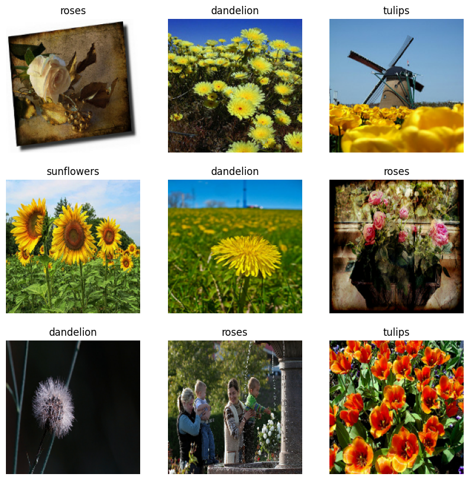
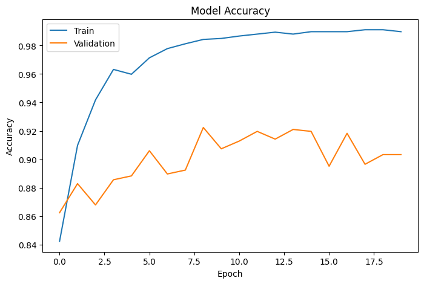
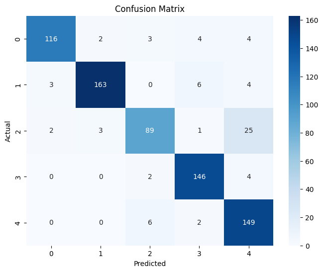

# Flower Classification using CNN

This project implements flower image classification using Convolutional Neural Networks (CNN) and Transfer Learning with MobileNetV2.

## Dataset
TensorFlow Flower Dataset

Classes:
- Daisy
- Dandelion
- Roses
- Sunflowers
- Tulips

## Technologies Used
- Python
- TensorFlow / Keras
- CNN
- Transfer Learning
- Matplotlib
- Scikit-learn

## Features
- Image classification
- Data augmentation
- Transfer learning using MobileNetV2
- Accuracy visualization
- Confusion matrix
- Precision and F1-score evaluation

## Results
- Validation Accuracy:  96%
- Accuracy - 98%
- precision - 90%
- F1 score - 90%

## Sample Images

  ## Accuracy Graph

## Confusion Matrix

## Author
-Ch.Rambhadra kumar
-rambhadrakumar23@gmail.com
-7207330113
